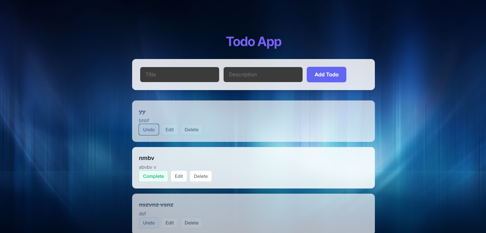

# Todo Application (Spring Boot + React)

A full-stack Todo application built with **Spring Boot** (Backend) and **React + Vite** (Frontend).


*(Place your screenshot here named `app-preview.png`)*

## Features

- **Create Todo**: Add new tasks with a title and description.
- **Read Todos**: View a list of all tasks.
- **Update Todo**: Edit task details or mark them as completed/pending.
- **Delete Todo**: Remove tasks from the list.
- **Data Persistence**: Uses H2 in-memory database (data resets on restart).

## Tech Stack

- **Backend**: Java 17+, Spring Boot 3, Spring Data JPA, H2 Database.
- **Frontend**: React 18, Vite, Axios, CSS3.

## Prerequisites

- **Java JDK 17** or later.
- **Node.js** (v18+ recommended) and **npm**.
- **Maven** (optional, wrapper included).

## Run Locally

### 1. Clone the Repository
```bash
git clone https://github.com/sagar00praveen/Todo-Application-Spring-Boot-React-.git
cd Todo-Application-Spring-Boot-React-
```

### 2. Start the Backend
Navigate to the backend directory and run the Spring Boot application.

**Using PowerShell (Windows):**
```powershell
./start-backend.ps1
```

**Or manually:**
```bash
cd backend
./mvnw spring-boot:run
```
The backend will start at `http://localhost:8081`.

### 3. Start the Frontend
Open a new terminal, navigate to the frontend directory, install dependencies, and start the dev server.

```bash
cd frontend
npm install
npm run dev
```
The frontend will start at `http://localhost:5173`.

## API Endpoints

- `GET /api/todos` - Get all todos.
- `POST /api/todos` - Create a new todo.
- `PUT /api/todos/{id}` - Update a todo.
- `DELETE /api/todos/{id}` - Delete a todo.

## Project Structure

```
├── backend/            # Spring Boot Application
│   ├── src/main/java   # Java Source Code
│   └── pom.xml         # Maven Dependencies
├── frontend/           # React Application
│   ├── src/            # React Source Code
│   ├── public/         # Static Assets
│   └── package.json    # NPM Dependencies
└── README.md           # Project Documentation
```
